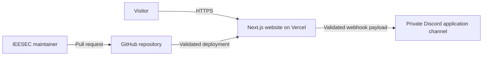
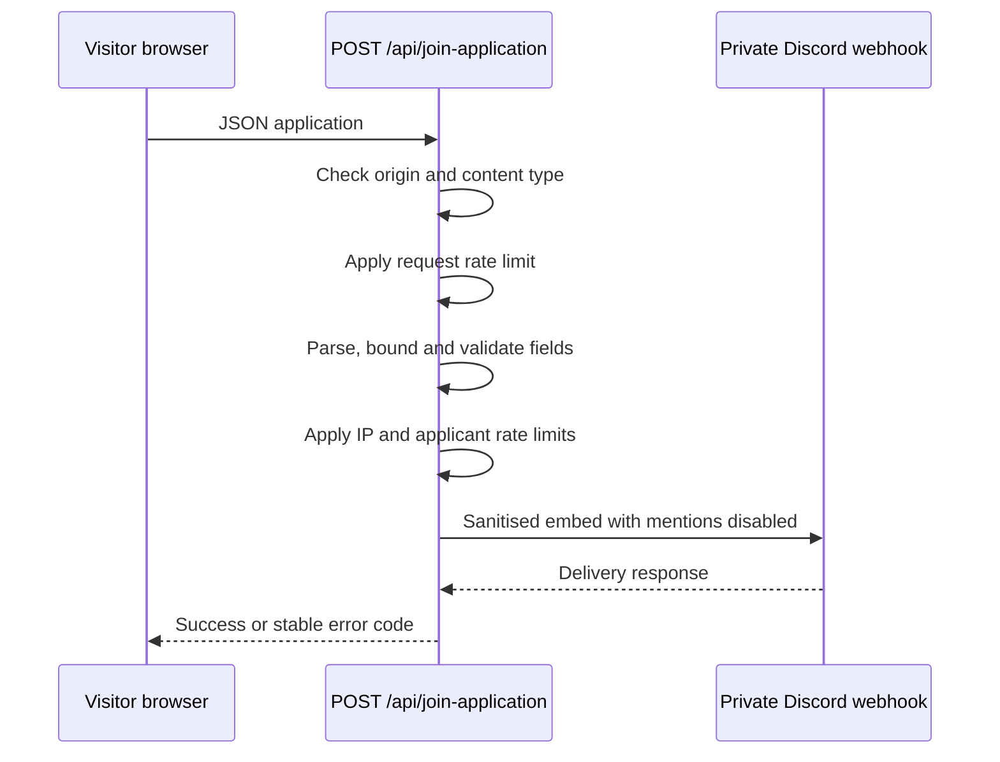

# Architecture

## System context

IEESEC maintains a public bilingual website for current and prospective IHU students. Visitors read community content and may submit a join application. Maintainers update versioned content and operate the Vercel deployment and private Discord destination.

No application database is used. Homepage content and translations are versioned in the repository.

## Containers and responsibilities

| Area                           | Responsibility                                                                 |
| ------------------------------ | ------------------------------------------------------------------------------ |
| `src/app/[locale]`             | Localized pages, metadata and static route generation                          |
| `src/components`               | Shared navigation, footer, UI primitives and page sections                     |
| `src/i18n`                     | Supported locales, locale-aware links and request configuration                |
| `messages`                     | Greek and English user-visible copy                                            |
| `src/app/api/join-application` | Trust boundary for application validation, abuse controls and Discord delivery |
| `src/lib/seo.ts`               | Canonical production URL and social image metadata                             |
| `tests`                        | Logic, asset-budget, accessibility, responsive and browser behavior contracts  |

## Rendering and routing

The project uses the Next.js App Router. All user-facing pages live under the dynamic `[locale]` segment. Supported locales are `el` and `en`; Greek is the default. Locale prefixes are always present and automatic locale detection is disabled.

`src/proxy.ts` applies `next-intl` routing to non-API, non-static requests. Pages call `setRequestLocale` so they can be statically rendered. Locale-aware internal navigation must use `Link` from `src/i18n/navigation.ts` rather than hard-coded locale prefixes.

The locale layout provides fonts, theme state, the skip link, navbar, footer and the translation provider. Pages supply their own `<main id="main-content">` landmark.

## Content model

The repository currently acts as the content system:

- General copy, biographies, labels and metadata live in `messages/el.json` and `messages/en.json`.
- Member identity, profile URLs and image paths live in `src/components/sections/team/Member.ts`.
- Technology entries live in `src/components/sections/tech-stack/data.ts`.
- Blog-card metadata lives in `src/components/sections/blog/BlogPost.ts`; there are no article routes yet.
- Projects and events are presentation placeholders rather than structured content collections.

See [content-guide.md](content-guide.md) before changing these areas.

## Join-application data flow

The route is a security and privacy boundary. It rejects untrusted browser origins, non-JSON requests, oversized or invalid payloads and excessive traffic. Rate-limit state is in memory and is therefore instance-local and ephemeral. It is a defence against casual abuse, not a globally consistent quota.

The webhook URL is server-only. The browser never receives it, and applicant submissions must not be logged or persisted elsewhere. See [operations.md](operations.md) for the contract and incident procedures.

## SEO and public discovery

Localized pages provide canonical and alternate URLs. `src/app/sitemap.ts` enumerates the home, join and privacy routes for both locales. `src/app/robots.ts` references the sitemap. The production origin is centralised in `src/lib/seo.ts`.

When adding a public page:

1. Add the route under `src/app/[locale]`.
2. Add localized metadata and language alternates.
3. Add it to the sitemap when it should be indexed.
4. Add both-locales route and metadata coverage.

## Quality attributes

- Accessibility: keyboard operation, visible focus, reduced motion and WCAG 2.2 AA contrast.
- Performance: responsive image/video tiers and explicit asset-size budgets.
- Resilience: readable server-rendered content without JavaScript.
- Privacy: minimal data collection, private delivery and time-bounded retention.
- Security: server-only secrets, validation at the API boundary and disabled Discord mentions.

## Decisions

Long-lived decisions are recorded in [adr/](adr/README.md). Update an ADR when changing its decision rather than silently contradicting it in implementation.
